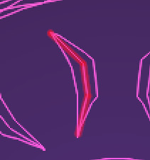

# Gendala

Gendala is an pygame based image generator that generates patterns visually similar to mandalas. It is intended for non-real time rendering, for example for generating wallpapers.

---

## For the impatient

### Just to see what they look like

If you just want to run it and have fun generating mandalas, the program should be ready to run. Just run `main.py` in the `common` directory. Pressing `R` will discard current mandala and start generating a new one. Pressing `S` will
save the mandala once the rendering is finished.

### Automating a wallpaper (for windows)

Windows is a real pain in the ass with updating wallpapers from a script... but this solution seemed to work for me. The root directory contains a batch and a powershell script for automating wallpaper generation. The powershell script is for making windows refresh the wallpaper, and the batch script just bundles the python program and the wallpaper script together.

In order to automate a new wallpaper:
* Edit the `refreshwallpaper.ps1` so that it reflects your local path to the exported file, as defined in the `settings.ini` (`exportFolder/exportName`).
* Add a shortcut to `wallpaper.bat` in your windows startup folder.
* From `settings.ini`
   * Set `resolution` to your liking.
   * Set `export` to `true`.
   * Set `randomExportName` to `false`.
   * (Optional) Set `hidden` to `true`. This hides the window so the wallpaper will be generated silently in the background (and it's a surprise when it's done!).

---

## Settings

The program is configured through the `settings.ini` file, which defines how the program is run and what parameters to use in random generation. Most of the settings are explained in more detail in the file itself, but below you can read up on the top level context of the details.

### Geometric hierarchy
In order to understand the settings, it is good to understand the basic structure of a mandala as defined by this program. The geometric hierarchy is as follows:

Hierarchy level | Name | Description | Image
----------------|------|-------------|-------
1 | Mandala | Top level, contains several layers | 
2 | Layer | Circular set of features | 
3 | Feature | A set of ribbons | 
4 | Ribbon | A pattern drawn along a curve | 
5 | Curve | A set of points | 

### Simple and complex features

The settings file distinguishes between simple and complex features using basically complex feature as a parent of several simple features. In the image below, the entire red area is the complex feature, and the red lines divide the complex feature into four simple features. Taking mirroring into account it consists of two different simple features, so it's `complexity` is 2. It also has `intercontinuity` (continuity between adjacent complex features, highlighted with orange dots) as well as `intracontinuity` (continuity between adjacent simple features, highlighted with green dots).

### What settings to focus on

There are a lot of settings and they have varying impact in the looks and performance of the generator. Threshold and coefficient settings adjust how strictly are results validated or discarded, and others impact the generated results themselves. Here are some tips what to play around with when you know what you want visually, but don't know what settings to tweak. The opposite can ofcourse be applied to these scenarios.

* "The mandala feels packed, I want more empty space."
    * Decrease the `fillScoreThreshold`, increase `fillScoreAreaCoeff` or decrease `fillScoreCentricCoeff`
    * Decrease `PD_complexity` of section `SimpleFeatures`
    * Increase `dividerPadding`
* "The ribbons overlap and are ugly."
    * Decrease `PD_complexity` of section `SimpleFeatures`
    * Decrease `maxSineAmplitude` or `maxArcAmplitude`
    * Adjust `maxTaperLength` and `maxTaperLength` closer to `0.5`
* "The shapes are boring."
    * Increase `PD_complexity` of section `ComplexFeatures` or section `Curves`
    * Increase the weights of arc and sine in `PD_connectionType`
* "The shapes are narrow or there are too many of them in a single layer."
    * Increase `PD_complexity` of section `ComplexFeatures`
    * Increase `featureWidthCoeff`
* "The shapes feel too disconnected."
    * Increase `P_interContinuous` or `P_intraContinuous`
    * Set `connectionOverridesMirror` to `true`
* "The layers do not feel circular enough or their borders are not clean."
    * Increase `P_divider`, `dividerWidth` or `dividerPadding`
    * Set `fractionBoundaryForceDivider` to `true`
* "There are too many sharp corners."
    * Increase the number of zeros at the beginning of `PD_subDivisions`

### Console output and hanging

The information that is printed during generation is meant for estimating the remaingin time for the image, as well as debugging too strict thresholds. If the whole output just fills up with output that reads "discarded", that means that the thresholds are too strict, and the generator is just constantly generating invalid results.
